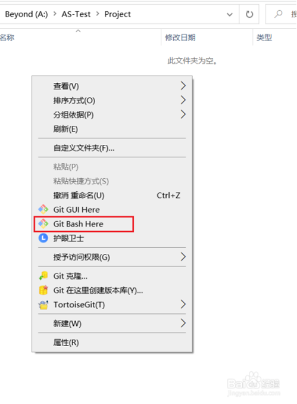
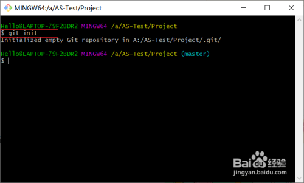
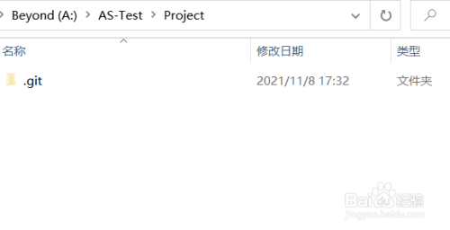
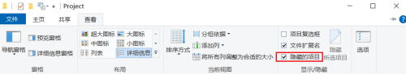
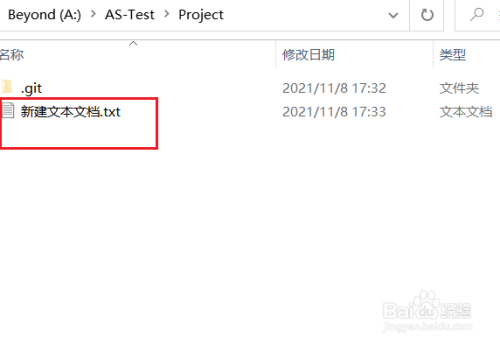
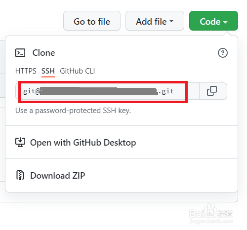
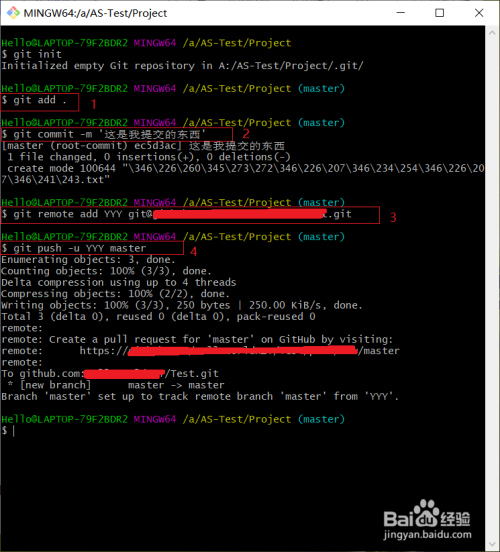
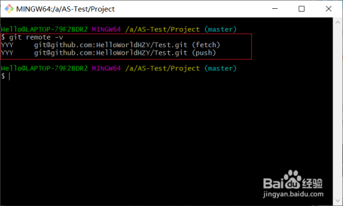
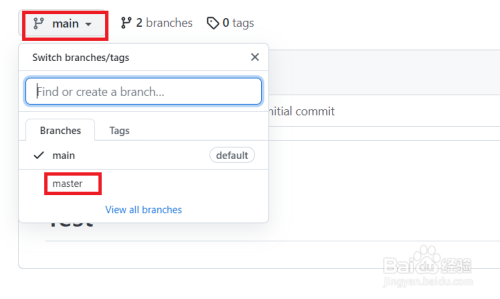
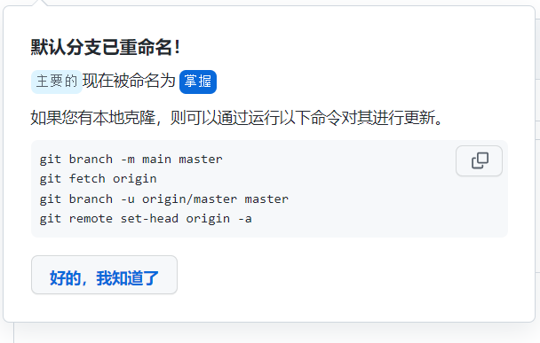

SYSTEM All users 

GLOBAL All repositories of the current user

LOCAL The current repository

 

$ git config --global user.name xxxx

 

$ git config --global user.email xxxxx@gmail.com

 

[可选，目前用的notepad++]
 git config --global core.editor "code --wait"

 

[查看配置文件]

$ git config --global -e

 

[windows | macOs&linux 换行标识]

$ git config --global core.autocrlf true|input

 

[弹出page.html]

$ git config –help

 

[cmd中列出命令]

$ git config –h

 

[显示配置路径]

$ git config --list --show-origin

 

 

[指定仓库路径]

$ cd xxxx/xxxx/xxx

 

[设置为仓库]

$ git init

 

[查看文件|查看目录]

$ ls | $ ls -a

 

[windows 打开文件夹| mac 打开文件夹]

$ start .git | open .git

 

[清空.git仓库历史信息及配置]

$ rm -rf .git

 

[编辑或创建文件并写入内容 使用 windows|linux mac]

$ echo hello > file1.txt

$ echo hello > file2.txt

 

[向文件并追加内容 使用 windows|linux mac]

$ echo hello >> file1.txt

 

[仓库当前的状态 是否有未提交的commit 是否有未保存到git的文件]

$ git status

 

[仓库内批量添加.txt文件]

$ git add *.txt

 

[仓库内批量递归添加文件夹下所有文件 进阶可以学习命令忽略某些重要或者大型数据文件]

$ git add .

 

[每次添加仓库，需要1+次add和一次commit提交说明]

$ git commit -m "wrote a readme file"

 

[跳过暂存台 直接提交]

$ git commit -am "Fix the bug that prevented the users from signing up."

 

[同上 不过会打开编辑器 添加说明文本]

$ git commit

 

[从工作区删除某个文件]

$ rm file2.txt

 

[查看git中文件 此时ls文件夹内已删除 需要add提交到暂存台 重新commit进行删除]

$ git ls-files

 

[从工作台和暂存台删除某个文件 某些文件]

$ git rm file2.txt *.txt

 

[修改文件名称和类型]

$ mv file1.txt main.js

 

[修改文件需要俩次add 对应delete和add]

$ git add file1.txt 

$ git add main.js

 

[区别于mv 不需要俩次add提交暂存台 直接commit即可 因其直接工作于工作台与暂存台]

[暂存区会识别 如果在一次提交内对一个文件进行多次修改 会合并成一次commit]

$ git mv main.js file1.js

 

 

[添加仓库内新建文件]

$ git add readme.txt

 

[修改文件需要俩次add]

$ git add file1.txt 

$ git add file1.txt

 

 

[仓库当前的状态]

$ git status

 

[查看前后修改的对比]

$ git diff

 

[上传GitHub]

$ git remote add rqiang + 地址

$ git pull --rebase origin master

$ git push origin master

[修改GitHub]

$ git push

$ git push --set-upstream rqiang master

**Git with GitHub**

 

为了方便，我们在一个空的文件夹中进行这个教程。我们在需要上传文件的文件夹中右击鼠标，选择Git Bash Here。

首先，用" **git init** "命令初始化本地仓库，初始化成功后，会出现一个.git文件夹。如果你没有看到，可能是你没有把" 隐藏的项目 "这个选项选中。

我们新建一个文件用来上传。

打开Github上你创建的库，找到红色方框中的内容，复制一下。

命令" **git add .** "：把Project文件夹中所有的文件都添加到本地仓库暂存区。

2、命令" **git commit -m '****备注'** "：为文件备注。

3、命令" **git remote add +** **仓库名 + 连接地址** "：名字随便写，连接地址为第四个步骤中叫你复制的内容。

4、命令" **git push -u** **仓库名 master** "：把本地仓库的文件上传到远程仓库。

**如果你想验证YYY仓库是否添加，可以用命令" git remote -v "。**

**如果你想删除YYY仓库，可以用" git remote remove YYY "（git remote remove 仓库名）。**

如果命令" **git push -u YYY master** "执行失败，则输入" **git pull --rebase YYY master** "命令（**git pull --rebase** **仓库名 master**），然后在输入" **git push -u YYY master** "命令。

打开Github上的库，找到图中所示的内容。

点击master选项，就会出现如图所示的内容。

 

 

 

删除分支

远处库名称：origin
 远处分支名：origin/dev
 删除该分支：`git push origin --delete dev`

 

 

有意义的攻略：https://www.cnblogs.com/szrs/p/15315325.html

 

 

